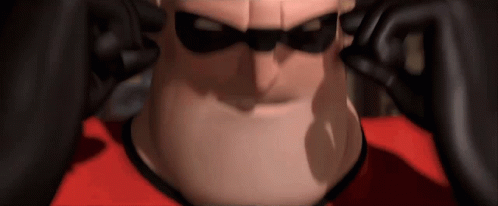

# showtime

showtime is custom animation software based on parsing MIDI and lighting up LEDs in sync with various MIDI notes. the code is intended to be synched to a Raspberry Pi which hosts a webserver. the webserver can be hit over wifi where it will serve a webpage with controls or it can be hit by a separate process on the Raspberry Pi that responds to button presses on an OLED + button bonnet.

## organization

note: there are servers because button reads and LED signals are GPIO and require `sudo` and anything VLC-related requires not `sudo`, but they must be able to communicate.

- to_sync: everything that should be synched to the Pi witth the sync scripts
  - busking_songs: .wav files of songs with all instrumentation included for busking
  - concert_songs: .wav files of songs with keyboard parts left out for concerts
  - fonts: the OLED screen library needs fonts in order to display text
  - reference: example code from libraries I used
  - sequences: folders with MIDI files exported from my DAW and Python scripts that contain animations depending on the MIDI files
  - static: webpage and assets to be served from the Pi
  - unused: idk other reference files maybe
  - clear.py: turns all the LEDs off (if you stop the code in the middle of a sequence the lights will just stay on lol)
  - config.py: imported file that contains the configuration used (brightness, "fps", number of pixels (LEDs), etc.)
  - led_server.py: server for starting and stopping LED sequences that are in sync with songs
  - parse_midi.py:
  - run-locally.sh: the function that should be run by systemd so it starts automatically when the Raspberry Pi boots (it will run song_server.py)
  - song_server.py: server for handling button presses, playing songs using VLC, and sending commands to the light sequence
  - utils.py: has lots of (often timing related) utility functions that are used in most of the LED sequences
